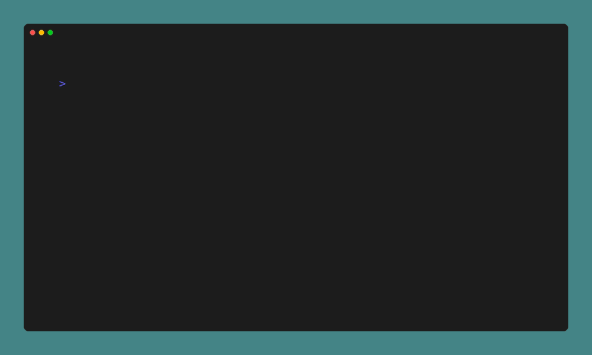

# Turing Machine Simulator - TMS

An Alan Turing machine simulator written in Rust as part of my personal learning journey to master the Rust programming language.

## Demo



## Getting Started

Follow these instructions to get the Turing Machine simulator up and running on your system.

### Prerequisites

Before you begin, ensure you have the following installed:

- [Rust](https://www.rust-lang.org/tools/install) - The Rust programming language.

### Installation

1. Clone the repository:

    ```bash
    $ git clone https://github.com/LanaMirko04/tms
    $ cd tms
    ```

2. Build the project:

    ```bash
    $ cargo build --release
    ```

3. Install the program:
    ```bash
    $ cargo install --path ./
    ```

4. Run the program:

    ```bash
    $ tms --conf examples/example.cfg
    ```

## Usage

```bash
$ tms --conf path/to/cfg/file
```

## License

TMS is licensed under the MIT License. See the [LICENSE](LICENSE) file for more details.


## Acknowledgements

 - [The Rust Programming Language Book](https://doc.rust-lang.org/stable/book/)
 - [The Cargo Book](https://doc.rust-lang.org/stable/cargo/)
 - [Ratatui](https://github.com/ratatui-org/ratatui)
 - [VHS](https://github.com/charmbracelet/vhs)

